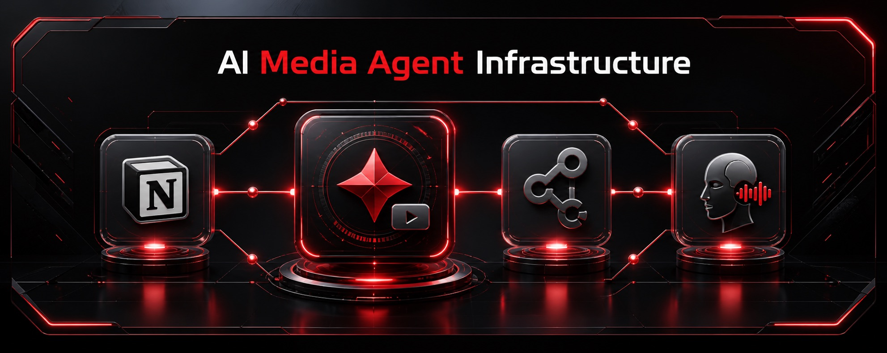

# AI Media Agent — Ultimate Sup



Operational workspace for **Ultimate Sup AI Media**: producing traceable, brand-safe social assets for the Singapore sports-nutrition market. It separates reusable brand sources and campaign deliverables from the local production runtime that generates images, video, voice, and post-production outputs.

## Start Here

Read these in order before starting a production task:

1. [`AGENTS.md`](AGENTS.md) — workspace rules, claim safety, role boundaries, and delivery standards.
2. [`BASE/BASE-STRUCTURE.md`](BASE/BASE-STRUCTURE.md) — authority for the BASE sectors.
3. [`PRODUCTION/AGENT.md`](PRODUCTION/AGENT.md) — runtime dispatch, goals, roles, and video modules.
4. [`DOCS/README.md`](DOCS/README.md) — full documentation map.
5. The active campaign's `Ticket.md` — approved product facts, offer, audience, language, CTA, and acceptance criteria.

When sources conflict, stop and flag it. The active `Ticket.md` governs the deliverable; do not silently invent claims, SKU details, price, promotion, or CTA.

## Workspace Map

```text
.
├── AGENTS.md                  # Workspace-wide operating and safety rules
├── BASE/                      # Source library, strategy workspace, campaign outputs
│   ├── BRAND KITs/            # Read-only retailer assets, templates, prompt references
│   ├── CAMPAIGNs/             # Canonical social-production units
│   └── STRATEGIES/            # Marketing strategy and ticket staging
├── DOCS/                      # Architecture, operating guides, status, product governance
├── .agents/skills/            # Canonical shared workspace skills
├── .claude/                   # Claude role profiles and skill adapter
├── .codex/agents/             # Codex role adapters
└── PRODUCTION/                # Self-contained execution runtime
    ├── AGENT.md               # Production runtime authority
    ├── goal/                  # Social-format goal templates
    ├── .agents/skills/        # Production skills
    ├── .claude/agents/        # Claude production roles
    ├── .codex/agents/         # Codex production-role adapters
    ├── video_modules/         # Flowkit, Applio, Hyperframes, talking-head editing
    └── env.local              # Local credentials; never commit or expose
```

## Canonical Campaign Storage

All new social production belongs in:

```text
BASE/CAMPAIGNs/[IP] Campaign/[Platform]/[Format]/[Date Folder]/
├── Ticket.md                  # Approved brief and acceptance criteria
├── caption.md                 # Final caption, when applicable
├── manifest.json              # Written last, after verification
├── [final deliverables]       # .jpg, .png, .mp4, etc.
└── node/                      # Prompts, drafts, source maps, QA, logs, handoffs
```

AI Media defaults to `UltimateSup Plus Campaign` unless the ticket specifies another IP. `BASE/BRAND KITs/` is a source library, not an output location. Preserve approved assets: use a new dated revision unit rather than overwrite them.

## Production Flow

1. **Content executive** interprets the ticket and creates the brief, caption, script, and any required shooting script.
2. **Designer** resolves visual direction, references, static creative, and thumbnail work.
3. **Video editor** executes approved sequences, voice/video generation, edit, upscale, and technical QA when video is required.
4. **Notion publisher** performs only an authorized final handoff and completes `manifest.json` after deliverables pass checks.

Use the selected goal in [`PRODUCTION/goal/`](PRODUCTION/goal/) and its named skills. Read each skill's `SKILL.md` and each video module's nested instructions before execution. Runtime modules include Flowkit for generation/upscale, Applio for brand voice, Hyperframes for composition, and the talking-head editing pipeline.

## Non-Negotiables

- **Singapore first:** use Singapore market context, SGD, and Shopee Singapore unless the ticket explicitly says otherwise.
- **Claims require evidence:** verify public-facing facts against the approved ticket, current label/approved listing, and product-owner approval. [`DOCS/product/`](DOCS/product/README.md) is a working reference, not a blanket publishing license.
- **Credentials stay local:** never print, upload, document, or commit `env.local`, `.env`, tokens, cookies, or service-account files.
- **Traceable delivery:** validate the file, technical format, copy, variant, offer, CTA, and claim safety before writing `manifest.json` or handing off.

## Documentation

| Document | Purpose |
| --- | --- |
| [`DOCS/ARCHITECTURE.md`](DOCS/ARCHITECTURE.md) | Durable scope, precedence, approval gates, and storage decisions. |
| [`DOCS/FOLDER-STRUCTURE.md`](DOCS/FOLDER-STRUCTURE.md) | Folder ownership, authority mapping, role/skill inventory. |
| [`DOCS/QUICK-REFERENCE.md`](DOCS/QUICK-REFERENCE.md) | Intake, routing, template reuse, claim-safety, and handoff checklist. |
| [`DOCS/PROGRESS.md`](DOCS/PROGRESS.md) | Current implementation state and next actions. |
| [`DOCS/BLOCKERS.md`](DOCS/BLOCKERS.md) | Active blockers and responsible next owner. |
| [`DOCS/product/README.md`](DOCS/product/README.md) | Product knowledge scope and publication guardrails. |

## Quick Checks

```bash
# Inspect all governing instructions for a production task
ls -la AGENTS.md BASE/BASE-STRUCTURE.md BASE/CAMPAIGNs/CAMPAIGNs-STRUCTURE.md PRODUCTION/AGENT.md

# Inspect installed production skills and local video modules
find PRODUCTION/.agents/skills -mindepth 1 -maxdepth 1 -type d | sort
find PRODUCTION/video_modules -mindepth 1 -maxdepth 1 -type d | sort
```
