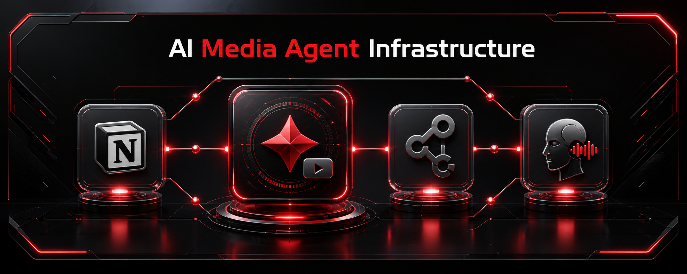

# AI Media Agent — Ultimate Sup Infrastructure



Operating infrastructure and agent runtime for **Ultimate Sup** (Singapore sports-nutrition retailer), focusing on automated AI image/video creative generation, UGC video sequence execution, and social media production workflows.

## Workspace Layout

```text
.
├── AGENTS.md                  # Root instructions & safety guardrails
├── BASE/                       # Brand kits, strategies, and production outputs
│   ├── BRAND KITs/             # Product prompt templates, presets, and brand assets
│   ├── CAMPAIGNs/              # Canonical campaign output tree ([IP]/[Platform]/[Format]/YYYY-MM-DD)
│   └── STRATEGIES/             # Content strategy workspace
├── DOCS/                       # Documentation, architecture, quick reference, and product claims
│   ├── README.md               # Main documentation index
│   ├── ARCHITECTURE.md         # System scope, approval gates, and claim governance
│   ├── FOLDER-STRUCTURE.md     # Detailed directory mapping & agent capabilities
│   ├── QUICK-REFERENCE.md     # Pre-flight checklists & claim safety shortcuts
│   └── product/                # Approved product claims & nutritional data
└── PRODUCTION/                 # Autonomous production runtime
    ├── AGENT.md                # Production runtime authority
    ├── goal/                   # Production goal prompt library
    ├── .agents/skills/         # Production skills (Gemini Omni, Flowkit, Applio, Notion, etc.)
    └── video_modules/          # Video execution engines (Flowkit, Applio, Hyperframes, Talking-Head)
```

## Core Workflows

1. **Notion to Goal Ticket Ingestion (`notion2goal`)**
   - Pulls post tickets directly from Notion database.
   - Maps `Visual Type` to canonical Goal templates in `PRODUCTION/goal/`.
   - Prepares canonical campaign storage under `BASE/CAMPAIGNs/[IP] Campaign/[Platform]/[Format]/YYYY-MM-DD/`.

2. **AI UGC Short Video Generation**
   - Script generation & frame breakdown (`write-ai-ugc-video-sequence-script`, `tea-ugc-ai-realism`).
   - Reference image & prompt creation (`creative-direction`, `acad-image-gen`).
   - Video sequence rendering & flow execution via Flowkit (`flowkit-nano-banana-image-gen`, `flowkit-gemini-omni-video-gen`).
   - Voice synthesis & brand voice matching via Applio (`applio-brand-voice`).
   - Automated video post-production (captions, subtitle burn, audio mixing, thumbnail burn).

3. **Multi-Platform Creative Production**
   - Shopee / IG / TikTok creative assets structured according to Singapore retail standards (SGD, shopee.sg context).

## Quick Start & Setup

### 1. Requirements
- Node.js v22+
- Python 3.10+ / 3.12+ (for Applio, Flowkit, and Hyperframes)
- `ffmpeg` (for video post-production)

### 2. Environment Configuration
Create `env.local` in project root (or inside `PRODUCTION/env.local` for production-only tasks). File is excluded from Git via `.gitignore`.

```bash
# Example env.local keys
NOTION_API_KEY="ntn_..."
NOTION_POSTS_DB="your_posts_database_id"
NOTION_CAMPAIGNS_DB="your_campaigns_database_id"
APIFY_API_TOKEN="apify_api_..."
```

### 3. Running Production Goals
Production goals are invoked inside `PRODUCTION/`:
- Read `PRODUCTION/AGENT.md` for production runtime rules.
- Goal files reside in `PRODUCTION/goal/` (e.g. `[social]_[ai-ugc-short-video].md`).

## Security & Claim Safety
- **Credentials:** Never commit `env.local`, `.env`, API tokens, or Google Service Account JSON keys.
- **Market Context:** Default market is **Singapore** (SGD currency, Shopee SG).
- **Product Claims:** All product claims must be backed by approved sources in `DOCS/product/` or active tickets.

## License
See [`LICENSE`](LICENSE) file for license rights and limitations.
